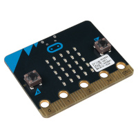
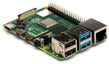

# LARM - Oficina de Robótica

Para ter acesso ao repertório no Drive acesse: [drive.google.com](https://drive.google.com/drive/folders/1smwZa7qAUykEbpON3Ec4JQgrqf3gDSvi).

## Bem vindo ao **seu site** de experimentos de **robótica**!

Este site representará uma vasta biblioteca de diversos experimentos relacionados a Arduino UNO, Micro:bit e Raspbarry pi. :rocket:

## Sumário:

### Arduino UNO:
- Nível fácil;
- Nível Médio;
- Nível Difícil.


### Micro:bit:
- Nível fácil;
- Nível Médio;
- Nível Difícil.



### Raspbarry pi:
- Nível fácil;
- Nível Médio;
- Nível Difícil.



### Membros do laboratório

| Nome | Idade | 
| ---- | ---- |
| Davi Viana | 19 |
| Guilherme Brandt | 19 |
| Gilherme paiva | 20 |
| André Bet | 19 |
| Arthur Ferrando | 20 |

## Testando Bloco de código

```{.c linenums="11" title="hello_world.c"}
    int main()
    {
        printf("Hello Word!",\n);
        return 0;
    }
```