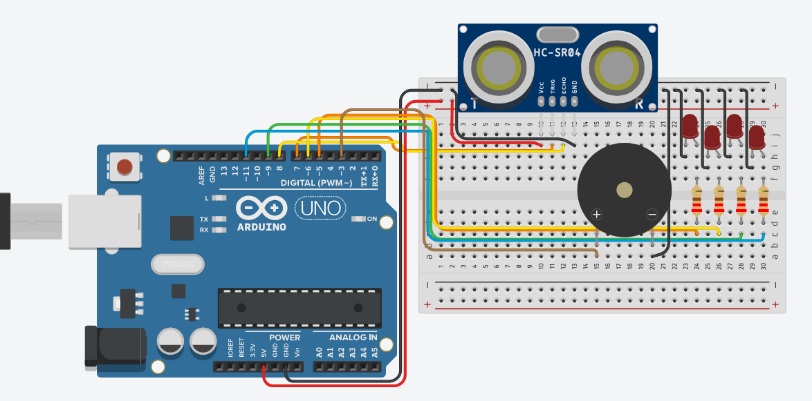
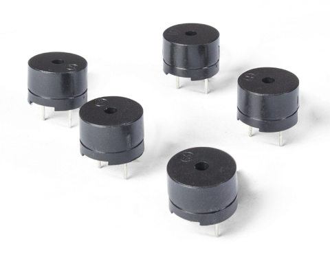
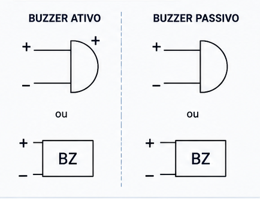
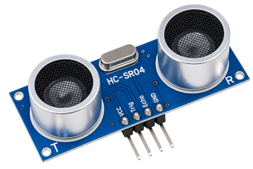
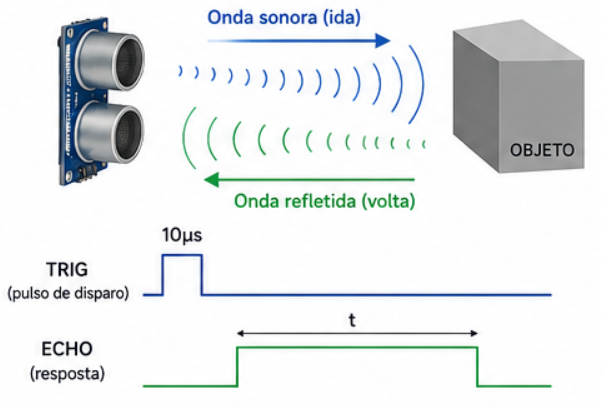
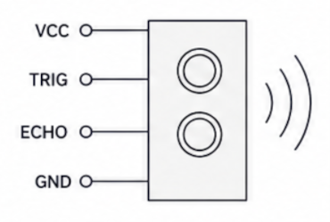
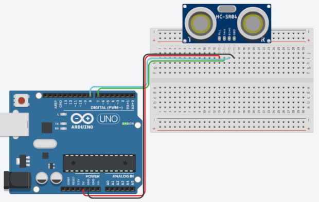
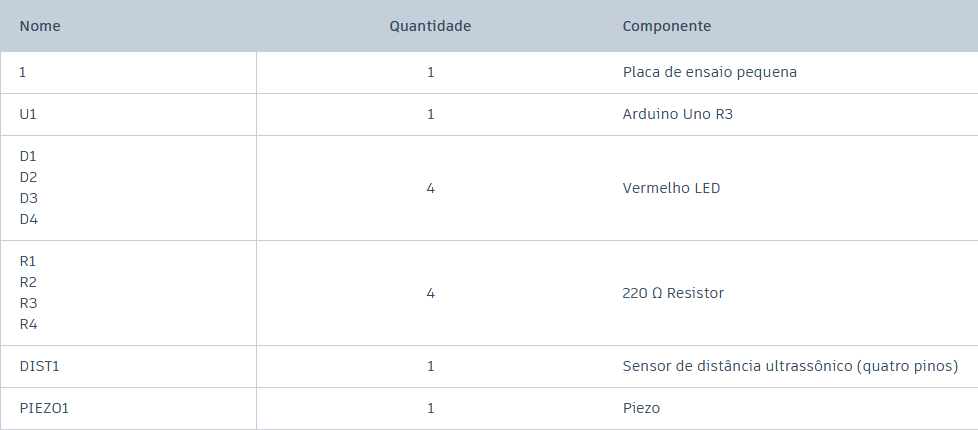
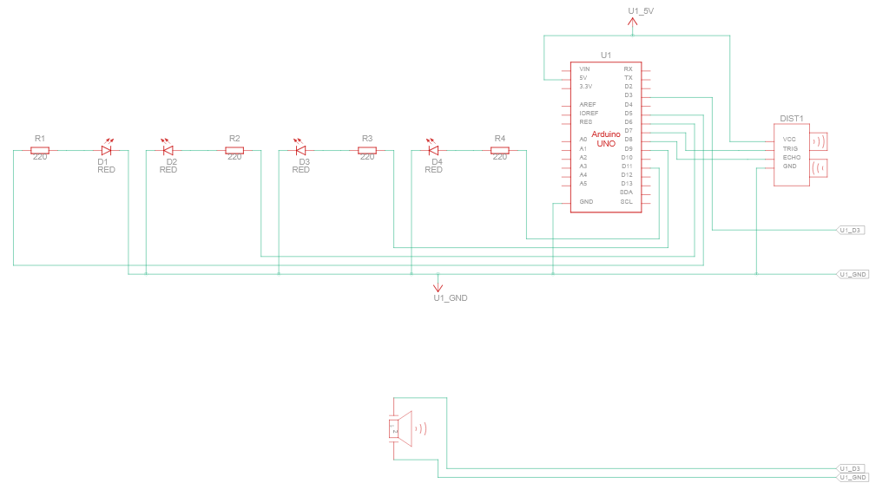
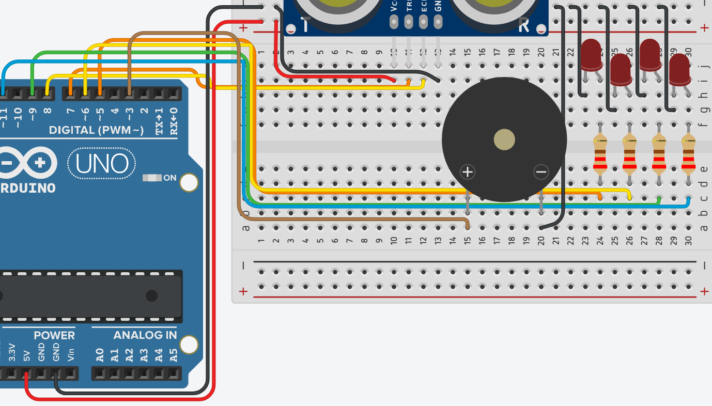

# Alarme sensor de ré

Neste experimento será ensinado a utilização do **sensor** de ultrassom, faremos um teste de distância para entende-lo, e na sequência será montado um sistema de **alarme semelhante ao da ré de carros** convencionais modernos. Para a segunda parte, também utilizaremos o **buzzer**, para produir som.

<br>
> Imagem do experimento (alarme):



<br>
## Entendendo os componentes

<br>
### Buzzer

O buzzer é um componente eletrônico utilizado para emitir sinais sonoros em circuitos. Ele funciona convertendo sinais elétricos em vibrações que produzem um som, podendo ser acionado por um microcontrolador, como o Arduino, para indicar eventos, alertas ou estados de um sistema. Em projetos de eletrônica e robótica, é comum utilizá-lo para criar alarmes, avisos sonoros, campainhas e pequenas melodias.

<br>
> Imagem de buzzers:



É importante dizer que existem 2 tipos de buzzers, o ativo e o passivo. O ativo possui um circuito oscilador interno, por isso basta aplicar uma tensão elétrica para que ele produza um som em uma frequência pré-definida de fábrica. Já o buzzer passivo não possui esse oscilador e precisa receber um sinal elétrico alternado, como o sinal PWM, para gerar o som. Assim, o buzzer passivo permite controlar a frequência e produzir diferentes notas, enquanto o ativo é mais simples para emitir apenas um som de alerta.

<br>
#### Especificações típicas:
- Tensão de operação: 3V a 12V (comum)
- Corrente: 1mA a 30mA (passivo), 10mA a 30mA (ativo)
- Nível de som: 70dB a 85dB (10cm de distancia)
- Frequência: 2kHz a 5kHz (faixa ideal)

<br>
> Símbolo esquemático:



<br>
### Sensor de ultrassom

O sensor de ultrassom é um dispositivo eletrônico capaz de detectar objetos e medir distâncias utilizando ondas ultrassônicas. Ele funciona emitindo uma onda sonora de alta frequência e medindo o tempo que ela leva para atingir um objeto e retornar ao sensor. Em projetos com Arduino e robótica, é muito utilizado para identificar obstáculos, realizar medições de distância e auxiliar na orientação de robôs.



<br>
#### Funcionamento passo a passo:
<br>

1. **Disparo (TRIGGER)**: O microcontrolador dispara um pulso a cada 10 microsegundos.
2. **Reflexão**: o pulso disparado reflete em uma superficie e retorna ao sensor.
3. **Recepção (ECHO)**: a entrada ECHO, que fica em HIGH enquanto o pulso não retorna, passa para estado LOW.
4. **Medição do tempo**: o tempo que ECHO ficou em HIGH será usada para medir a distancia em velocidade ultrassônica percorrida pelo pulso.
5. **Medição da distância**: Usando o tempo que o pulso percorreu em velocidade ultrassônica é calculado a distância percorrida. 

<br>
> Demonstração exemplificada:

<br>



<br>
O sensor de ultrassom convencional é alimentado com tensão de 5V. Possui uma boa precisão até, em média, 3m de distância, muitas vezes as especificação técnica diz um valor maior, mas na prática ele se perde antes. E seu ângulo de medição é de 15 graus, ou seja, tentar deixar obstaculos alinhado com o ultrassom para uma melhor medição.

<br>
> Símbolo esquemático:



<br>
#### Testando o sensor:

Antes de iniciarmos o experimento principal, vamos colocar e testar um sensor de distânca na protoboard para garantir a compreensão de seu funcionamento.

<br>
> imagem do teste a ser realizado:



<br>
A disposição do sensor com a protoboard e arduino é bem simples, apenas conecte o ECHO e TRIGGER em entradas digitais convencionais, e alimente-o com 5V. O foco da atenção se volta para o código que se encontra abaixo:

<br>

```{.cpp linenums="1" title="Teste do sensor"}
#define TRIGGER  7
#define ECHO     8

float calcularDistancia();
float lerDistancia();

void setup()
{
  pinMode(TRIGGER, OUTPUT);
  pinMode(ECHO, INPUT);
  Serial.begin(9600);
}

void loop()
{
  //leitura distancia ultrassom
  Serial.println(lerDistancia());
}

float calcularDistancia()
{
  float tempo = 0;

  digitalWrite(TRIGGER, HIGH);
  delayMicroseconds(200);
  digitalWrite(TRIGGER, LOW);

  // Calcular tempo a partir do diparo do sinal
  tempo = pulseIn(ECHO, HIGH);

  return tempo / 2 / 58;
}

float lerDistancia()
{
  delay(500);
  return calcularDistancia();
}
```
<br>

Inicialmente declaramos duas funções, uma para calcular distância e a outra para ler. Dentro da função setup(), observe que o pino do **trigger** fica como **saída de dados** e o **echo** como **entrada de dados**. Dentro do loop() printamos no monitor serial a distância detectada pelo sensor. Ao final, encontra-se a implementação odas funções.

Vamos analisar a implementação das funções declaradas: 

- **calcularDistancia()**: declara uma variável do tipo float para armazenar o tempo que o **echo** fica em **HIGH** (medição feita com a função **pulseIn()**), na sequência realizamos um high-low no **trigger**, gerando o disparo do pulso, porém 10 microsegundos entre um pulso e outro e muito pouco tempo para processar os dados, então adiciona-se um intervalo usando o **delay()**. O retorno é o valor da variável tempo, manipulado por divisões para se adequar a unidade de segundos.
- **lerDistancia()**: é um delay() + retorno da resposta da função anterior.

<br>
## Entendendo o circuito

<br>
> Relação de componentes:



<br>
Agora sim! Vamos começar o experimento. Como nosso objetivo é simular um alarme de ré, os LEDs, faremos com que os componentes se "agitem" conforme a distância do obstáculo diminui, ou seja, o barulho do buzzer vai aumentando e os LEDs vermelhos vão brilhando mais, e piscando mais rápido. Observe o circuito esquemático abaixo:

<br>
> Circuito esquemático: 



<br>
Observe que todos os LEDs e o buzzer estão conectados em entradas PWM, para podermos modular o sinal, gerado faixas de corrente diferentes, assim gerando intensidade de brilho e som alternativos em nossos componentes. Enquanto isso, conforme explicado sobre o sensor de distância, o ECHO e TRIGGER estão conectados em entradas digitais padrão. 

<br>
> Zoom nas ligações protoboard e arduino:

<br>


<br>
## Entendendo o código

Apesar de não haver nada de novo no código deste experimento, vamos analisa-lo com calma para garantir o entendimento do que acontecerá.

```{.cpp linenums="1" title="Definições e declarações"}
#define TRIGGER  7
#define ECHO     8

#define LED4     11
#define LED3     9
#define LED2     6
#define LED1     5
#define BUZZER   3

//Protótipos das funções
float calcularDistancia();
float lerDistancia();
void alarmeDesativado();
void estadoAlarme1();
void estadoAlarme2();
void estadoAlarme3();
```

<br>
Sempre mantenha uma boa organização em seu código, como exemplo: nomear as entradas e saídas, manter espacamentos uniforme e declarar o protótipo das funções no início do arquivo.

<br>
```{.cpp linenums="74" title="Funções dos estados do alarme"}
//corpo das funções do alarme de distância
void alarmeDesativado()
{
    analogWrite(LED1, 0);
    analogWrite(LED2, 0);
    analogWrite(LED3, 0);
    analogWrite(LED4, 0);
    analogWrite(BUZZER, 0);
}

void estadoAlarme1()
{
    analogWrite(LED1, 0);
    analogWrite(LED2, 0);
    analogWrite(LED3, 25);
    analogWrite(LED4, 25);
    analogWrite(BUZZER, 7); 
    delay(400);
    analogWrite(LED3, 0);
    analogWrite(BUZZER, 0); 
    delay(400);
}

void estadoAlarme2()
{
    analogWrite(LED1, 0);
    analogWrite(LED2, 40);
    analogWrite(LED3, 40);
    analogWrite(LED4, 40);
    analogWrite(BUZZER, 20); 
    delay(200);
    analogWrite(LED3, 0);
    analogWrite(LED4, 0);
    analogWrite(LED2, 0); 

    analogWrite(BUZZER, 0); 
    delay(150);
}


void estadoAlarme3()
{
    analogWrite(LED1, 100);
    analogWrite(LED2, 100);
    analogWrite(LED3, 100);
    analogWrite(LED4, 100);
    analogWrite(BUZZER, 80); 
 
}
```

<br>
As funções acima representam os estados do alarme de acordo com a distância medida, dentro das funções o funcionamento delas se resumem em utilizar **analogWrite()** para controlar o sinal de saída das portas PWM e delay() para criar intervalos de pisca pisca. A cada estado que vai avançando, vamos aumentando o valor do sinal, que aceita de 0 a 255 (representação máxima de 8 bits).

<br>
```{.cpp linenums="52" title="Funções do sensor de distância"}
float calcularDistancia()
{
    float tempo = 0;

    digitalWrite(TRIGGER, HIGH);
    delayMicroseconds(200);
    digitalWrite(TRIGGER, LOW);

    // Calcular tempo a partir do diparo do sinal
    tempo = pulseIn(ECHO, HIGH);

    return tempo / 2 / 58;
}

float lerDistancia()
{
    delay(500);
    return calcularDistancia();
}
```

<br>
Acima são exatamente as mesmas funções desenvolvidas no experimento de teste visto nesta mesma página um pouco mais acima.

<br>
```{.cpp linenums="18" title="setup() e loop()"}
void setup() {
  pinMode(TRIGGER, OUTPUT);
  pinMode(ECHO, INPUT);
  pinMode(LED1, OUTPUT);
  pinMode(LED2, OUTPUT);
  pinMode(LED3, OUTPUT);
  pinMode(LED4, OUTPUT);
  pinMode(BUZZER, OUTPUT);
  Serial.begin(9600);
  alarmeDesativado();

}

void loop() {
    //leitura distancia ultrassom
    Serial.println(lerDistancia());
    float distancia = lerDistancia();

    //funcionamento do alarme de acordo com a distância obtida
    if (distancia > 40) {
      alarmeDesativado();
      delay(100);
    }  
    else if  (distancia > 25 && distancia <= 40) {
      estadoAlarme1();
    }
    else if  (distancia > 15 && distancia <= 25) {
      estadoAlarme2();
    }
    else if  (distancia <= 15 ) {
      estadoAlarme3();
    }
}
```

<br>
Por fim, na função **setup()** declaramos apenas o ECHO como entrada de dados, e estabelecemos os demais pinos como saída de dado, além de inicializar a comunicação serial e estabelecer o estado inicial do alarme como desativado.

No **loop()**, realizamos o cálculo da distância, e baseado nesta informação criamos situações condicionais em que a distância registrada define qual estado o alarme deve executar. Repare que para distância maior que 40cm não há ativação do mecanismo do alarme, e conforme o obstáculo se aproxima vamos avançando para um estado mais alarmante. 

<br>
#### Código completo

```{.cpp linenums="1" title="código completo"}
#define TRIGGER  7
#define ECHO     8

#define LED4     11
#define LED3     9
#define LED2     6
#define LED1     5
#define BUZZER   3

//Protótipos das funções
float calcularDistancia();
float lerDistancia();
void alarmeDesativado();
void estadoAlarme1();
void estadoAlarme2();
void estadoAlarme3();

void setup() {
  pinMode(TRIGGER, OUTPUT);
  pinMode(ECHO, INPUT);
  pinMode(LED1, OUTPUT);
  pinMode(LED2, OUTPUT);
  pinMode(LED3, OUTPUT);
  pinMode(LED4, OUTPUT);
  pinMode(BUZZER, OUTPUT);
  Serial.begin(9600);
  alarmeDesativado();

}

void loop() {
    //leitura distancia ultrassom
    Serial.println(lerDistancia());
    float distancia = lerDistancia();

    //funcionamento do alarme de acordo com a distância obtida
    if (distancia > 40) {
      alarmeDesativado();
      delay(100);
    }  
    else if  (distancia > 25 && distancia <= 40) {
      estadoAlarme1();
    }
    else if  (distancia > 15 && distancia <= 25) {
      estadoAlarme2();
    }
    else if  (distancia <= 15 ) {
      estadoAlarme3();
    }
}

float calcularDistancia()
{
    float tempo = 0;

    digitalWrite(TRIGGER, HIGH);
    delayMicroseconds(200);
    digitalWrite(TRIGGER, LOW);

    // Calcular tempo a partir do diparo do sinal
    tempo = pulseIn(ECHO, HIGH);

    return tempo / 2 / 58;
}

float lerDistancia()
{
    delay(500);
    return calcularDistancia();
}


//corpo das funções do alarme de distância
void alarmeDesativado()
{
    analogWrite(LED1, 0);
    analogWrite(LED2, 0);
    analogWrite(LED3, 0);
    analogWrite(LED4, 0);
    analogWrite(BUZZER, 0);
}

void estadoAlarme1()
{
    analogWrite(LED1, 0);
    analogWrite(LED2, 0);
    analogWrite(LED3, 25);
    analogWrite(LED4, 25);
    analogWrite(BUZZER, 7); 
    delay(400);
    analogWrite(LED3, 0);
    analogWrite(BUZZER, 0); 
    delay(400);
}

void estadoAlarme2()
{
    analogWrite(LED1, 0);
    analogWrite(LED2, 40);
    analogWrite(LED3, 40);
    analogWrite(LED4, 40);
    analogWrite(BUZZER, 20); 
    delay(200);
    analogWrite(LED3, 0);
    analogWrite(LED4, 0);
    analogWrite(LED2, 0); 

    analogWrite(BUZZER, 0); 
    delay(150);
}


void estadoAlarme3()
{
    analogWrite(LED1, 100);
    analogWrite(LED2, 100);
    analogWrite(LED3, 100);
    analogWrite(LED4, 100);
    analogWrite(BUZZER, 80); 
 
}
```