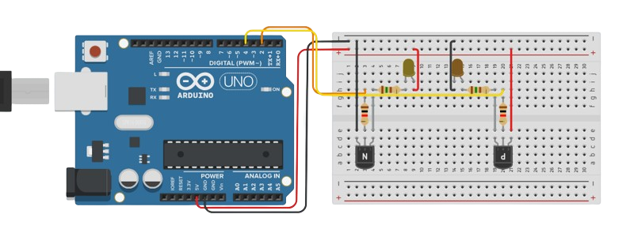
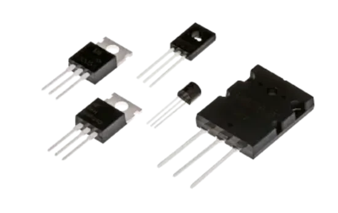
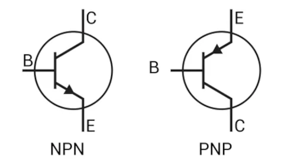
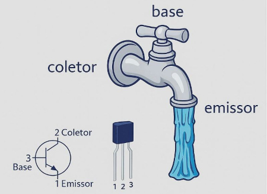
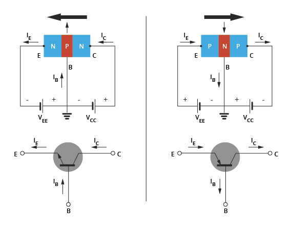
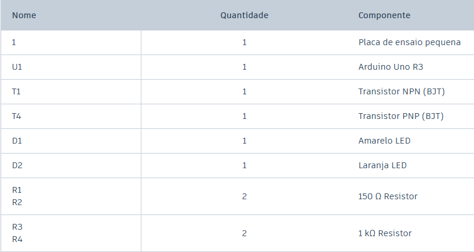
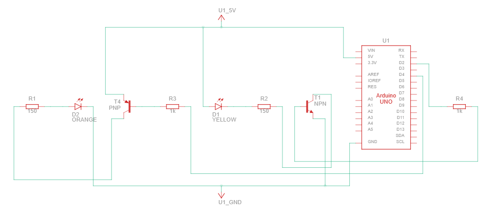
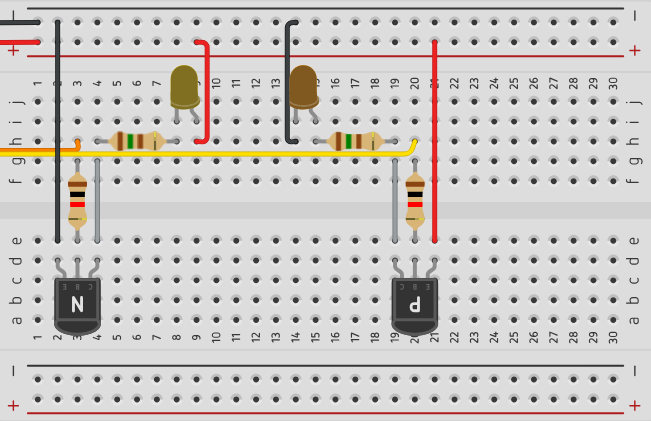
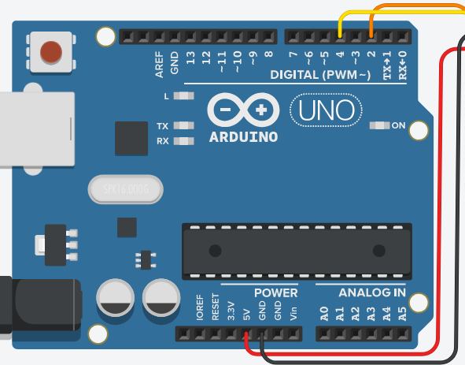

# Entendendo os transistores

Os transistores são componentes eletrônicos fundamentais para a robótica e para a computação, pois podem funcionar como chaves eletrônicas ou como amplificadores de sinais. Em projetos de robótica, eles permitem controlar dispositivos como LEDs, motores e outros componentes que exigem mais corrente do que um microcontrolador consegue fornecer diretamente.
 
Na computação, os transistores são ainda mais importantes, pois são utilizados para construir as portas lógicas responsáveis pelo processamento de informações e, quando combinados em grandes quantidades, formam os circuitos presentes em processadores e memórias.

<br>
>Foto do experimento:



## Transistores

<br>
Existem diversos tipos de transistores, sendo os mais comuns o BJT (Transistor de Junção Bipolar) e o MOSFET (Transistor de Efeito de Campo), **nós utilizaremos o BJT. Entre os BJTs, existem os modelos NPN e PNP, que possuem três terminais — base, coletor e emissor —**. Já os MOSFETs possuem os terminais gate, drain e source e são muito utilizados no controle de cargas que exigem maior corrente, como motores. 

<br>
> Diferentes transistores:



Os transistores de junção bipolar são os que utilizaremos nos experimentos, eles se dividem em dois tipos: **NPN e PNP**, que funcionam de maneira oposta. O **NPN** conduz quando a base recebe nível **HIGH**, enquanto o **PNP** conduz quando a base recebe nível **LOW**. Essa característica permite utilizá-los como chaves eletrônicas para controlar LEDs, motores e outros componentes nos nossos futuros experimentos.

<br>
> Símbolos esquemático NPN e PNT:



<br>
### Analogia da torneira

Podemos imaginar o transistor como uma torneira eletrônica: a corrente que passa entre o coletor e o emissor seria como a água passando pelo cano, enquanto a base funciona como o registro que controla essa passagem. Quando a base recebe o sinal adequado, o transistor permite a passagem da corrente, assim como abrir a torneira permite a passagem da água.

<br>
> Torneira como transistor: 




<br>
Observe a **imagem anexada abaixo**, ela  mostra o **funcionamento dos transistores NPN e PNP**, destacando a diferença no sentido da corrente elétrica. No NPN, a corrente convencional entra pelo coletor e sai pelo emissor, enquanto no PNP ocorre o sentido contrário. Essa diferença está relacionada à forma como as regiões semicondutoras (cada terminal é uma região semicondutora N ou P) são organizadas em cada transistor e determina como eles devem ser polarizados para entrar em condução. 

**OBS:** 

- Vcc -> tensão do coletor
- Vee -> tensão do emissor

<br>
> Esquema de funcionamento transistores:




## Entendendo o circuito 

<br>
> Relação de componentes:



<br>
O objetivo deste experimento é controlar o funcionamneto de LEDs utilizando de transistores NPN e PNP, desta forma sendo observável na prática o comportamento inverso entre os dois tipos, observe o seu esquema:

<br>
> Circuito esquemático:



Repare como o LED do transistor NPN se encontra, no circuito, antes do transistor, enquando o LED do PNP se encontra depois. Também é visível como a alimentação 5V (+) chega pelo emissor do PNP e pelo coletor do NPN. Agora observe aa imagem geral do experimento no começo da página e as ampliadas abaixo e se esforce a visualizar a implementação do esquema:

<br>
> Zoom protoboard:

<br>


<br>
> Zoom arduino

<br>


<br>
## Entendendo a programação

Na construção do código deste experimento veremos como otimizar e limpar nosso loop realizando a criação de funções. Em experimentos anteriores utilizamos funções várias vezes, porém talvez você não tenha percebido! Por exemplo o próprio loop() e setup().

### Funções

Uma função é um bloco de código criado para realizar uma tarefa específica dentro de um programa. Ela permite organizar, reutilizar e simplificar o código, evitando que os mesmos comandos precisem ser escritos várias vezes. Uma função pode receber dados de entrada, chamados de parâmetros, realizar operações com eles e, quando necessário, retornar um resultado. Por exemplo, podemos criar uma função para calcular a distância entre dois pontos e utilizá-la sempre que esse cálculo for necessário no programa. Para este experimento, usaremos apenas para "limpar" o loop(), deixando menos linhas de códigos dentro dele. 


### Explicando o código:

Nas linhas 4 e 5 foi declarado duas funções, uma para colocar entrada alta em ambas as bases dos transistores e outra para colocar entrada baixa. Poderiamos declarar e implementar o código das funções de uma vez, porém tal atitude é uma má prática entre programadores. Observe abaixo:

<br>
``` {.cpp linenums="1" title="Declarações"}
#define BASE_PNP 2
#define BASE_NPN 4

void high_nas_bases();
void low_nas_bases();
```

<br>
Para realizar a implementação de forma adequada de uma função, levamos ela para o final do código, neste caso, após o setup() e loop(). Veja no código abaixo como o que está implementado dentro da função é exatemente o que colocariamos no loop():

<br>
``` {.cpp linenums="20" title="Implementação"}
void high_bases()
{
digitalWrite(BASE_NPN, HIGH);
digitalWrite(BASE_PNP, HIGH);
}

void low_bases()
{
digitalWrite(BASE_NPN, LOW);
digitalWrite(BASE_PNP, LOW); 
}
```

<br>
O setup() permanece apenas para definirmos as entradas digitais como saída:

<br>
``` {.cpp linenums="6" title="setup()"}
void setup()
{
  pinMode(BASE_NPN, OUTPUT);
  pinMode(BASE_PNP, OUTPUT);

}
```

<br>
Agora o nosso loop() possui menos linhas de código, observe como uma única linha de código realiza alteração do sinal de ambas as bases, tornando o código mais fácil de ser compreendido.

<br>
``` {.cpp linenums="12" title="loop()"}
void loop()
{
  high_bases();
  delay(1000);
  
  low_bases();
  delay(1000);
}
```
<br>
### Código completo:

``` {.cpp linenums="1" title="Aprendendo transistores"}
#define BASE_PNP 2
#define BASE_NPN 4

void high_nas_bases();
void low_nas_bases();

void setup()
{
  pinMode(BASE_NPN, OUTPUT);
  pinMode(BASE_PNP, OUTPUT);

}

void loop()
{
  high_bases();
  delay(1000);
  
  low_bases();
  delay(1000);
}

void high_bases()
{
digitalWrite(BASE_NPN, HIGH);
digitalWrite(BASE_PNP, HIGH);
}

void low_bases()
{
digitalWrite(BASE_NPN, LOW);
digitalWrite(BASE_PNP, LOW); 
}
```
