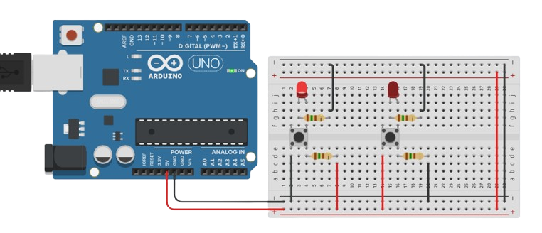
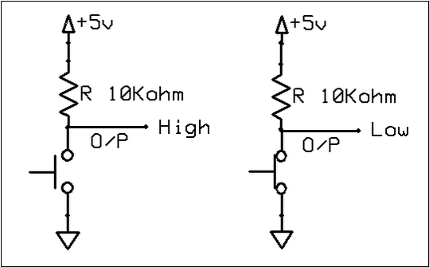
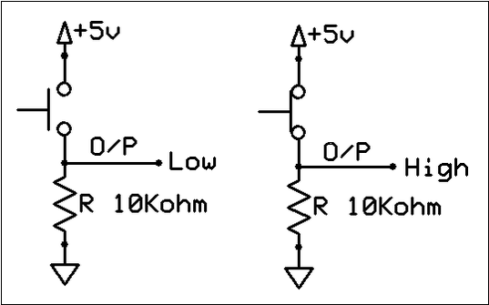
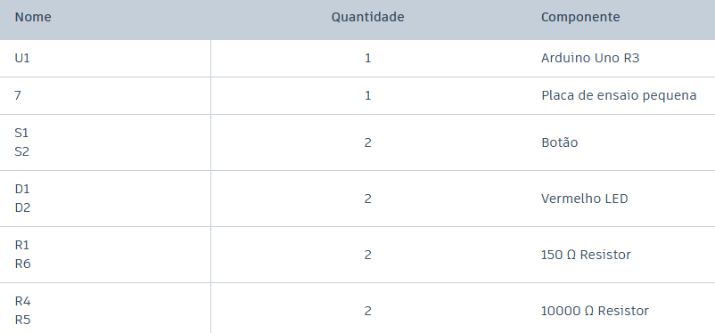
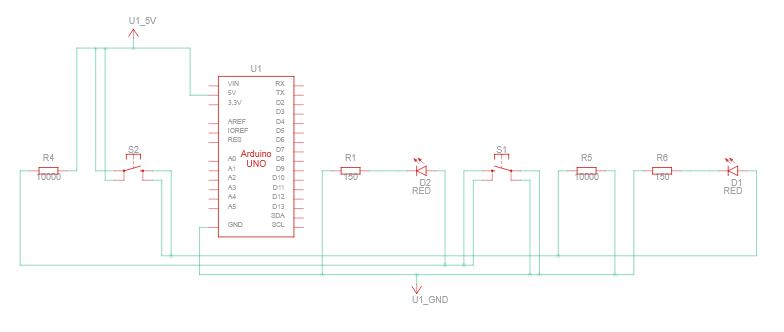
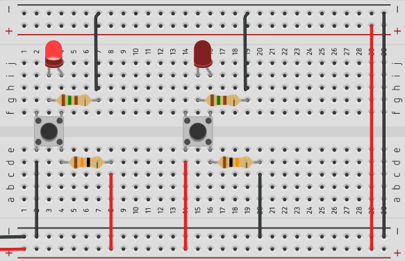
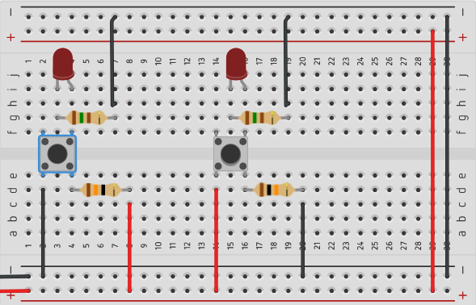
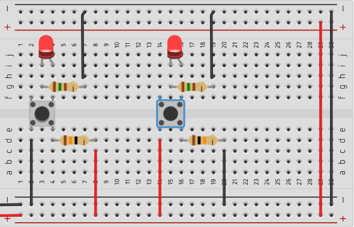

# Botões Pull Up e Pull Down

Neste experimento será ensinado a utilizar botões com ligações Pull Down e Pull Up. Um mecanismo simples que brinca utilizando de um resistor e a alteração dos sinais do botão para inverter seus valores de resposta.

> Imagem do experimento:

## Lógica Pull Down e Pull Up

 
Os botões Pull-Up e Pull-Down são utilizados em circuitos digitais para garantir que uma entrada, como a de um Arduino, permaneça em um nível lógico definido quando o botão não está sendo pressionado. No circuito Pull-Up, um resistor é conectado entre o pino de entrada e a alimentação positiva (VCC). Dessa forma, quando o botão está solto, a entrada recebe nível lógico HIGH (1). Ao pressionar o botão, o pino é conectado ao GND, fazendo com que a entrada passe para nível lógico LOW (0). Assim, o funcionamento do botão é considerado ativo em nível baixo, pois o acionamento produz o valor 0.

 
> Circuito Pull Up:

Já no circuito Pull-Down, o resistor é conectado entre o pino de entrada e o GND. Quando o botão está solto, o resistor mantém a entrada em nível lógico LOW (0). Ao pressionar o botão, a entrada é conectada ao VCC, passando para nível lógico HIGH (1). Nesse caso, o botão é considerado ativo em nível alto, pois seu acionamento produz o valor 1. Em ambos os circuitos, o resistor evita que a entrada fique em um estado indefinido (floating), garantindo uma leitura estável pelo microcontrolador.

 
> Circuito Pull Down:

 
## Entendendo o circuito

O circuito montado para este experimento é bem simples, tanto que será desnecessário a implementação de código. 

 
> Componentes do experimento:

 
### Circuito esquemático:

 
Observe no esquema que desta vez não há nenhum jumper utilizando de uma entrada digital ou analógica do Arduino, tudo que acontece parte de um 5V e retorna ao GND. Isso pelo fato de não estarmos rodando programa nenhum. Neste caso, a utilidade do Arduino é comparável a de uma bateria para alimentar o circuito.

 

Repare na utilização de 4 resistores. 2 deles estão sendo utilizados para proteção dos LEDs, mas e os outros dois? Bom, os de 150Ω são para os LEDs, e os de 10kΩ são responsáveis por fazer funcionar os botões Pull-Down e Pull-Up, colocar essas resistências altas fazem com que manipulemos a tendência de qual caminho a corrente de eletróns irá percorrer. Por exemplo, no botão do lado esquerdo do esquema, quando aberto a corrente flui pelo caminho com resistor 10k, ao ser pressionado a corrente tende a fluir pelo botão, pois a resistência é menor.

## Funcionamento

 
Inicialmente, é observável o LED esquerdo aceso, e o LED direito apagado. Nenhum botão pressionado.

 
> Estado inicial: 

 
Na segunda imagem, o LED esquerdo passa para o estado de LOW, isso acontece pois foi pressionado o botão Pull-Down.

 
> Pull-Down precionado:

 
Na terceira imagem, o LED direito está em HIGH, o motivo é o botão Pull-UP estar pressionado. Fechando um caminho de menor corrente que passa pelo LED.

 
> Pull-Up precionado:

