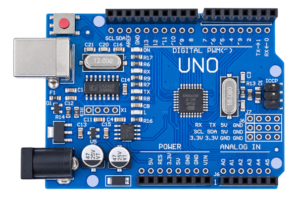
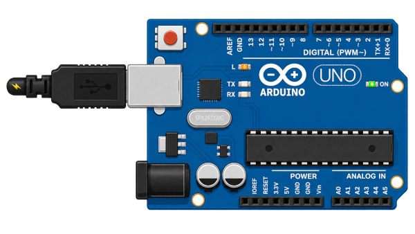
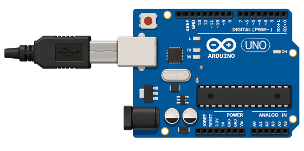

# Acendendo o LED do Arduino

Este é o primeiro experimento com a placa de desenvolvimento Arduino UNO. Para começar, vamos entender um pouco sobre essa placa e suas entradas.

## O Arduino UNO
O Arduino Uno é uma placa de prototipagem eletrônica baseada no microcontrolador ATmega328P. Ele permite criar projetos eletrônicos por meio da programação de entradas e saídas digitais e analógicas. A placa possui pinos que podem ser conectados a sensores, LEDs, motores e diversos outros componentes. Sua programação é realizada principalmente pela linguagem C/C++, utilizando a IDE do Arduino. Por ser simples e possuir grande quantidade de materiais disponíveis, o Arduino Uno é bastante utilizado no aprendizado de eletrônica e programação. Ele também será a ferramenta que utilizaremos para realizar os experimentos neste módulo.

> link do site do arduino: [Site arduino](https://www.arduino.cc/)



## Mão na massa
Neste experimento usaremos indiretamente a entrada digital 13, pois "brincaremos" de acender e apagar o led que fica ao lado desta entrada (na imagem apacendo como "ON"). A lógica é simples, com comandos de HIGH e LOW definimos se o sinal na entrada é alto (com energia) ou baixo (sem energia). Para isso utilizaremos de uma plataforma que nos permita programar códigos para serem rodados no arduino, no caso, utilizamos o Arduino IDE. Vamos analisar o código abaixo:

> link para dowload da IDE: [Dowload IDE](https://www.arduino.cc/en/software/)

```{.cpp linenums="1" tittle="LED13"}
void setup()
{
  pinMode(13, OUTPUT);
}

void loop()
{
  digitalWrite(13, HIGH);
  delay(1000); 
  digitalWrite(13, LOW);
  delay(1000); 
}
```
### Separação setup e loop

No Arduino, a função setup() é executada apenas uma vez, logo após a placa ser ligada ou reiniciada, sendo utilizada para realizar configurações iniciais, como definir os pinos de entrada e saída. Já a função loop() é executada continuamente enquanto o Arduino estiver funcionando. É nela que normalmente são colocadas as principais ações do programa, como ler sensores, acionar LEDs e controlar outros componentes.

### pinMode()

O pinMode() é uma função que utiliza dois parâmetros (palavras dentro do parênteses), o primeiro identificamos a entrada que trataremos, e o segundo definos se a entrada atuará com entradas (INPUT) ou saídas (OUTPUT) de dados.

### digitalWrite()

Usada pra realizar escrita nos pinos digitais, digitalWrite() é outra função de 2 parâmetros, em que o primeiro novamente é a entrada a ser tratada e o segundo é usado para definir se ela será sinal alto ou baixo.

### delay()

É uma função de parâmetro único, colocamos dentro dela uma quantia de tempo em milisegundos, e este tempo o arduino interpretara como um "momento de espera" antes de executar a próxima linha de código.

## Resultados
O led ao lado da porta 13 ficará acendendo e apagando em intervalos de 1 em 1 segundo (1000 milisegundos). como demonstra as imagens abaixo:


<br>
> led aceso



<br>
> led apagado




