# Controlando LEDs com potenciômetro

Neste experimento abriremos portas para a compreensão do potenciômetro, que é um resistor variável. Ciente disso, iremos controlar a intensidade do brilho de dois LEDs usando um potenciômetro. Para ampliar a curva de aprendizado, um dos LEDs terá um botão, para podermos analisar seu funcionamento e interferência no circuito.


<br>
> Foto do experimento:

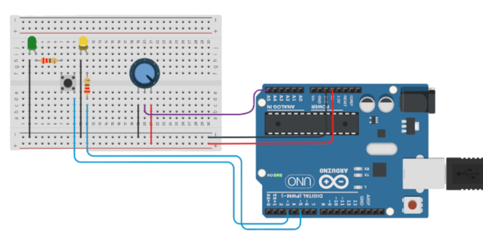

## Entendendo o potenciômetro

<br>
O potenciômetro é um componente eletrônico que funciona como um resistor variável, permitindo controlar manualmente a resistência presente em um circuito por meio de um botão ou eixo giratório. Ele possui três terminais e pode ser utilizado para regular tensão, controlar o brilho de LEDs, ajustar a velocidade de motores, controlar o volume de áudio, entre outras aplicações. Em projetos com Arduino, o potenciômetro é bastante utilizado como entrada analógica, permitindo que o Arduino leia diferentes valores conforme o botão é girado e utilize essas informações para controlar outros componentes do circuito.


<br>
> Potenciometro comercial:

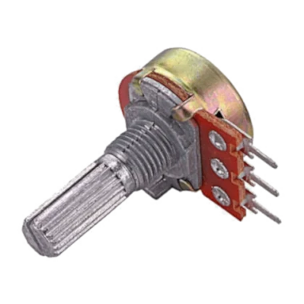

Os dois terminais externos correspondem às extremidades da resistência, enquanto o terminal central, chamado de cursor, varia sua posição conforme o eixo é girado. Ao conectar os terminais externos à alimentação e ao GND, o terminal central fornece uma tensão variável. Ao girar o potenciômetro para um lado, o cursor se aproxima de um dos terminais, fazendo a tensão de saída aumentar ou diminuir; ao girá-lo para o lado oposto, ocorre o contrário. Assim, girando para a direita ou para a esquerda, é possível controlar gradualmente o valor de tensão lido pelo Arduino. Observe a imagem abaixo:


<br>
> Terminais e sentido de giro:

<br>
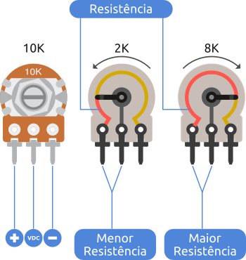

## Entendendo o botão

O botão, também conhecido como push button, é um componente utilizado para controlar um circuito por meio de um simples toque. Apesar de possuir quatro terminais, internamente eles são organizados em dois pares de terminais que já estão conectados entre si; ao pressionar o botão, os dois pares passam a se conectar, permitindo a passagem de corrente.


<br>
> Push button:

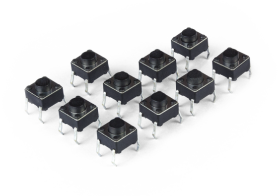

 Na protoboard, você deve ter o cuidado de não usar terminais do mesmo lado (por exemplo: cima esquerda e baixo esquerda), assim, garantindo que cada par de terminais fique em lados diferentes. Em projetos de robótica e Arduino, ele é muito utilizado como entrada digital, permitindo, por exemplo, iniciar ou interromper uma ação, trocar modos de funcionamento ou controlar LEDs e motores.


<br>
> Interior do botão:

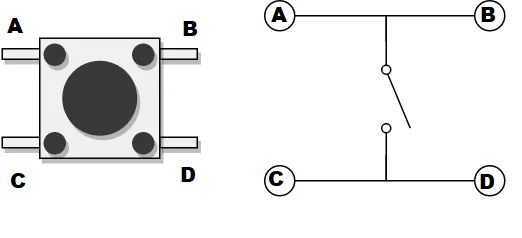

## O Experimento


<br>
> Relação de componentes:

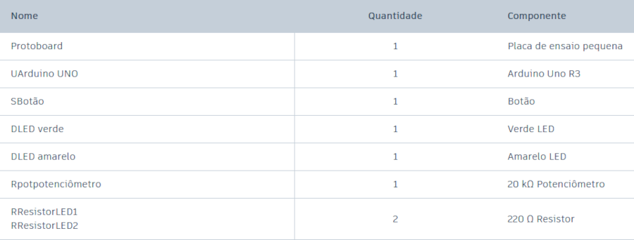

### Circuito esquemático

Novamente, vamos analisar o esquema do nosso circuito para facilitar a compreensão do que está acontecendo na protoboard. Atento a todos usuários para ignorar a letra randômica presente no nome de cada componente do esquema e da tabela acima.


<br>
> Esquema:

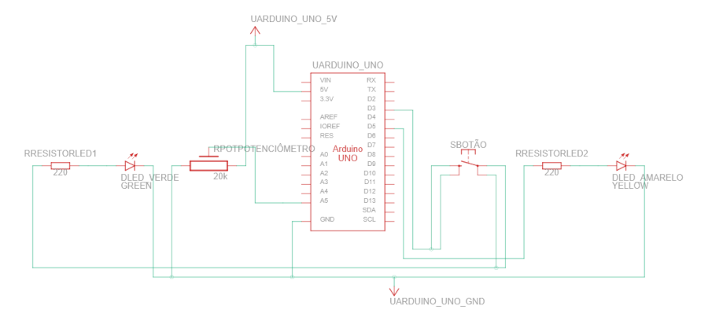

O circuito inteiro permanece com GND comum para todos os componentes, tanto o potenciômetro quanto os LEDs dividem a mesma etrada terra da placa Arduino. Observe também o LED verde, e veja como ele acende apenas se o botão estiver com a chave fechada. note como, no potenciômetro, o terminal do meio parte direto para a entrada analógica A5, esse barramento é o que levara a leitura da resistência do potenciômetro para o Arduino. Agora analise as fotos com zoom do experimento abaixo, e visualize o esquema implementado na prática:


<br>
> Zoom protoboard:

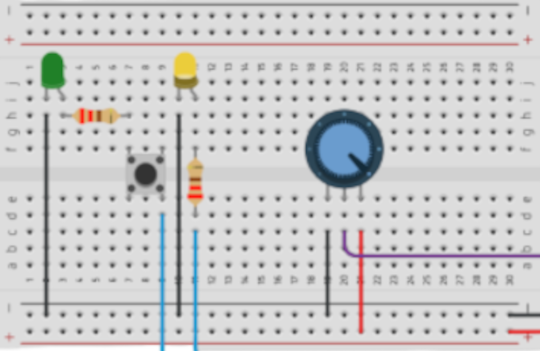


<br>
> Zoom Arduino:

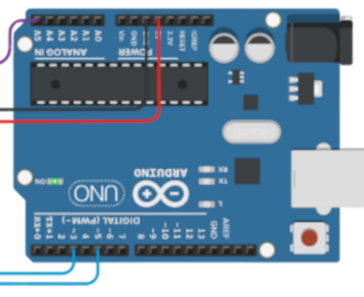

## Entendendo o código:

<br>
Na função setup() apenas definimos os LEDs como OUTPUT e a entrada analógica do potenciômetro como INPUT, além de inicializar a leitura serial com velocidade de 9600 bits por segundo, pois vamos ler a resistência do nosso resistor variável,

``` {.cpp linenums="1" title="setup()"}
#define LED_VERDE  3
#define LED_AMARELO 5
#define POT A5

void setup()
{
  pinMode(LED_VERDE, OUTPUT);
  pinMode(LED_AMARELO, OUTPUT);
  pinMode(POT, INPUT);
  Serial.begin(9600);
}
```

<br>
A função loop() permanece muito semelhante ao experimento do LDR, em que criamos duas variáveis, uma armazena os sinais/valores enviados pelo potenciômetro, a outra pega esses valores usa da função map() para remapear os valores para uma faixa de 0 a 255, ambas variáveis são printadas no Monitor Serial. Na sequência, usamos a função analogWrite() para estabelecermos o controle do brilho dos LEDs de forma analógica usando dos valores mapeados do potenciômetro. Finalizando com um delay de 200 milissegundos para haver um pequeno intervalo entre uma leitura e outra, sem esse delay, a depender do Arduino, problemas de funcionamento podem aparecer.


<br>
``` {.cpp linenums="12" title="loop()"}
void loop()
{
  int val = analogRead(POT);
  Serial.print("Valor 0 a 1023: ");
  Serial.println(val);
  int val_refinado = map(val, 0, 1023, 0, 255);
  Serial.println(val_refinado);
  Serial.print("Valor 0 a 255: ");
  analogWrite(LED_VERDE, val_refinado);
  analogWrite(LED_AMARELO, val_refinado);
  delay(200);
}
```

## Resultados

Após montado e ligado, você observará LEDs que o brilho segue a resistência do resistor variável, porém o LED verde acende apenas quando a chave do botão estiver fechada (pressionada). Recomendo testar com o monitor serial aberto ao lado, e comparar os dados de leitura do potênciometro com o brilho do seu LED! Abaixo algumas imagens representando o que era para acontecer: 


<br>
> Monitor Serial:

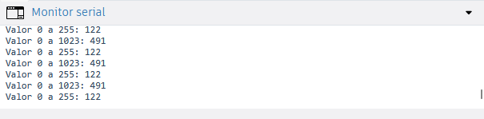


<br>
> Potenciômetro com resistência baixa:

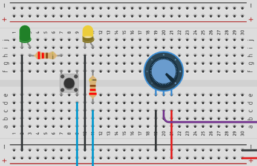


<br>
> Potenciômetro com resistência baixa e botão pressionado:

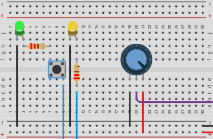


<br>
> Potenciômetro com resistência alta:

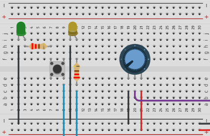


