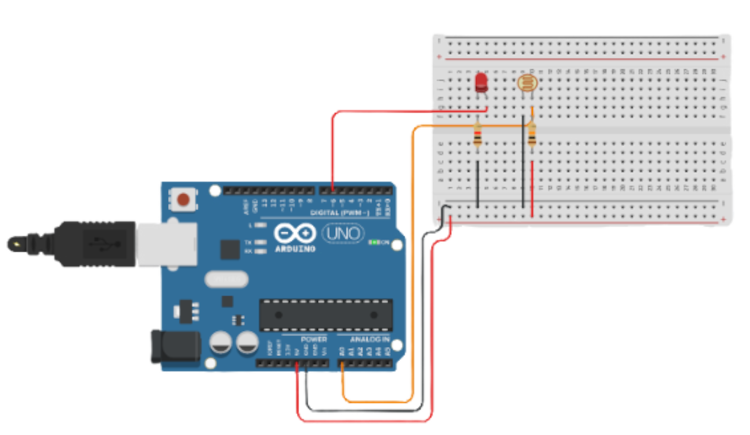
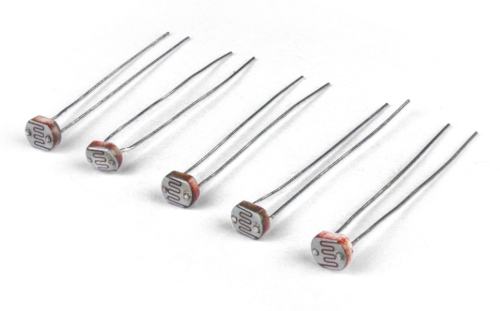
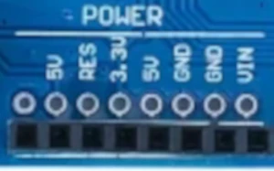
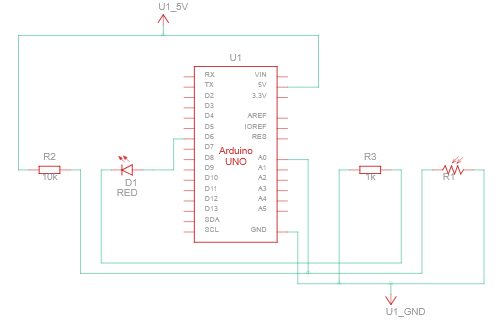
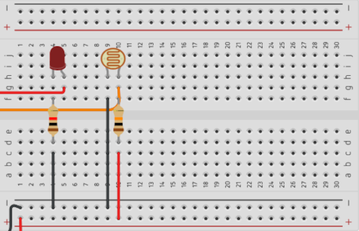
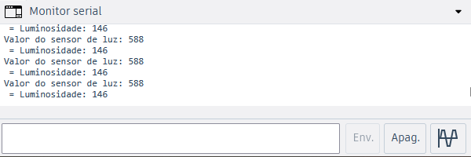

# Controlando LED com o LDR

Neste experimento iremos realizar o controle do brilho de um led baseado nos dados obtidos por um sensor de luminosidade, para isso aprenderemos a utilizar entradas analógicas e PWM do Arduino UNO, como também utilizaremos o monitor serial para visualizar os dados lidos por este sensor.


<br>
> Foto do experimento:



## Entendendo o LDR

**O LDR** é um sensor que **detecta a quantidade de luz** presente no ambiente. Sua resistência elétrica varia de acordo com a intensidade da luz: **quanto maior a iluminação, menor sua resistência**. Utilizaremos nos projetos com Arduino para detectar ambientes claros ou escuros e controlar componentes, como LEDs, que por sinal é o caso deste experimento.


<br>
> LDRs:



## Aprofundando no Arduino


<br>
### Entradas analógicas

As **entradas analógicas** do Arduino permitem **medir diferentes níveis de tensão**, sendo úteis para sensores que fornecem valores variáveis, como o LDR. No Arduino Uno, elas são identificadas de **A0 a A5** e podem ser **lidas com a função analogRead()**, que retorna valores de 0 a 1023, representando a tensão recebida pelo pino.

### Entradas PWM

As **entradas PWM** do Arduino Uno **permitem controlar a intensidade de um sinal** por meio de rápidas alternâncias entre ligado e desligado. A proporção do tempo em que o sinal permanece ligado, determina sua intensidade média. Esse recurso pode ser usado para controlar o brilho de LEDs e a velocidade de motores. No Arduino Uno, os pinos que possuem suporte a PWM são identificados pelo símbolo `~`.

### Os pinos "POWER"

Na placa do seu arduino é vísivel um conjunto de 8 pinos com 7 deles nomeados em uma área chamada **POWER**, eles são voltados há alimentação e terras, tanto para nossos circuitos quanto para o arduino. Os pinos marcados por **"5V" e "3.3V"**, **fornecem tensão**, então os usamos para alimentar nossos projetos na protoboard por exemplo, diferentemente do pino **"VIN"**, que é utilizado para **alimentar a própria placa do Arduino** quando este não conectado há um computador. Os pinos com **"GND"**, como já explicado em experimentos anteriores, é a abreviação "ground", e é uma **saída terra** na própria placa, levamos para eles as saídas negativas afim de **fechar o circuito**. E por fim, "**RES**" é simplesmente a abreviatura de **"reset"**.


<br>
> Entradas POWER:




<br>
## Entendendo a montagem


<br>
### Relação de componentes
- 1 Arduino UNO;
- 1 Protoboard;
- 1 LED vermelho;
- 1 LDR;
- 2 Resistores: 
    1. 1 de 220Ω
    2. 1 de 10000Ω

### O Circuito esquemático

Para todo projeto que realizamos com o arduino, construímos caminhos fechados por onde a eletricidade percorre, isso são os chamados circuitos, para **facilitar a compreender** sua estrutura muitas vezes montados esquemas, ou seja, circuitos esquemáticos. Observe o circuito esquemático deste experimento:


<br>
> Circuito esquemático:



Vamos analisar! O LED (triângulo com duas setas apontando para fora) está conectado a saída digital 6, repare que diferentemente do experimento anteror, o resistor do LED não aparece entre o LED e a D6, mais sim entre o LED e o GND, isso acontece pois não importa se o resistor está antes ou depois do LED, deis de que haja um desses caras controlando a corrente no barramento do circuito que reside o LED.


Observe que o LDR (ruído com 2 setas para dentro) possui tanto a saída 5V quanto a entrada A0 chegando em seu polo positivo, isso acontece pois LDR será IMPUT, ou seja, o Arduino não envia sinal nenhum para ele, o contrário, ele que envia sinais para o Arduino, por isso é preciso puxar um barramento da saída 5V para alimentar o LDR, além disso ele precisa de um resistor mais graúdo (10k) devido sua sensibilidade. Por fim, quero que repare que tanto o LED quanto o LDR dividem uma saída GND comum.


Agora que já visto o esquema do circuito do projeto, fica muito mais fácil e compreensível olhar para a foto da protoboard e entender o que está acontecendo alí. Observe o zoom na protoboard abaixo e em caso de dúvidas volte e releia o esquema deste circuito:


<br>
> Zoom protoboard:



## Entendendo o código:

### Variáveis

Antes de continuar, é necessário ententer o que são as variáveis e quais os seus tipos. **Elas são espaços na memória utilizados para armazenar dados que podem ser utilizados e modificados durante a execução de um programa**. Cada variável possui um tipo, os principais são: `int`, `float`, `char` ou `bool`, que define o tipo de informação armazenada por ela. Por exemplo, uma variável pode guardar a idade de uma pessoa, o valor de um sensor ou o estado de um LED. As infrormações de cada tipo encontram-se abaixo:

- **int**: números inteiros;
- **float**: números com decimais (ponto flutuante);
- **char**: um caractere (uma letra ou símbolo);
- **bool**: um valor booleano (verdadeiro ou falso).

É necessário pontuar que todos esses tipos detem de limitações, principalmente quanto ao tamanho do dado armazenado, mas isto é assunto para outro momento.


<br>
### Código

A começar pelo setup(), definimos como de costume o LED como OUTPUT, mas o LDR como IMPUT, já que ele envia sinais para o Arduino. O diferencial que vale a atenção é a linha 7 do código: **Serial.begin(9600)**, esta linha é responsável por inicializar a comunicação serial a uma velocidade de 9600 bits por segundo (velocidade máxima do Arduino), ou seja, ele recebe nesta velocidade os sinais enviados pelo LDR.

``` {.cpp linenums="1" title="setup()"}
#define LDR A0
#define LED 6

void setup() {
  pinMode(LDR, INPUT);
  pinMode(LED, OUTPUT);
  Serial.begin(9600);
}
```

Na função loop(), criamos duas variáveis ("valorLDR" e "luminosidade"), a primeira armazena as informações brutas entregues pelo sensor de luz, a segunda armazena as mesmas informações, porém agora trabalhadas pela função map() (função que converte uma faixa de valores para outra) para ficar mais prático a utilização desses dados.

Nas linhas 15 e 16 usamos funções seriais para podermos mostrar dados no monitor, ".print" para printar o que queremos digitar e ".println" para printar valores armazenados por alguma variável. Por fim, nas linhas 20 e 21, usado a função analogWrite() (escrita analógica) para enviarmos intensidade de sinal ao LED de acordo com a luminosidade do LDR, isso é possível pois estamos utilizando uma entrada PWM.


<br>
``` {.cpp linenums="9" title="loop()"}
void loop() {
  //Leitura do sensor de luz
  int valorLDR = analogRead(LDR);
  int luminosidade = map(valorLDR, 0, 1023, 0, 255);

  //Visualização do valor no Monitor Serial
  Serial.print("Valor do sensor de luz: ");
  Serial.println(valorLDR);
  
  Serial.print(" = Luminosidade: ");
  Serial.println(luminosidade);
  analogWrite(LED, luminosidade);
  delay(100);
}
```
### Monitor serial

Depois de concluído a montagem e alimentado o circuito, o LED deve brilhar de acordo com a quantidade de luz incidente sobre o LDR, porém ainda falta visualizar os valores das variáveis que printamos anteriormente, para isso basta **abrir o monitor serial**. Caso esteja usando o Arduino IDE, basta clickar **"ctrl + shift + M"**, ou buscar uma lupinha no canto superior direito de sua tela!


<br>
> Valores no monitor serial:

