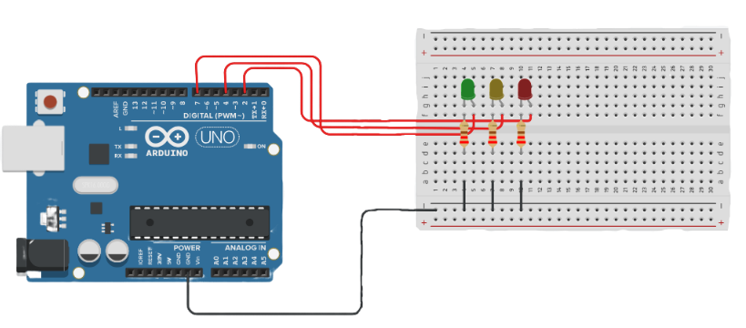
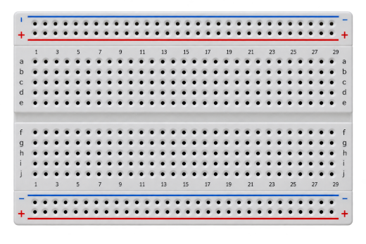
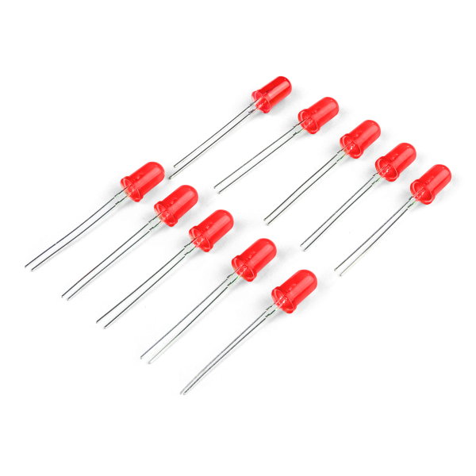
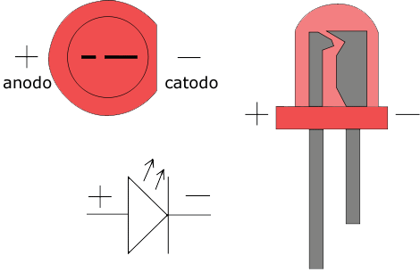
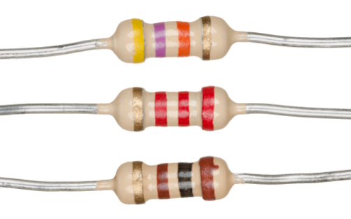
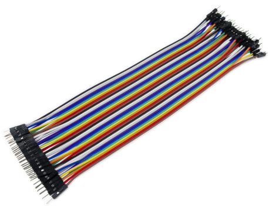
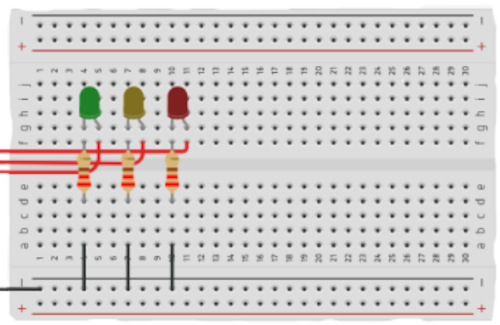
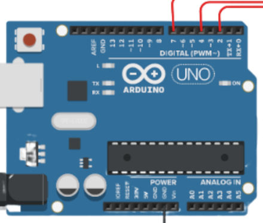

# Montando um semáforo
Neste experimento realizaremos a montagem de um semáforo, os conceitos utilizados serão muito semelhante ao "acender led da porta 13", porém agora utilizaremos de uma protoboard, gerenciaremos múltiplos LEDs e faremos barramentos utilizando de jumpers.

> foto do experimento:



## Entendendo os componentes

### Protoboard
É a placa com dezenas, se não centenas, de pinos, ela servirá de base para construir os experimentos de forma que os materiais utilizados possam ser removidos posteriormente. Seu funcionamento é simples, basta saber que os pinos são interconectados em linhas para as partes mais externas (local das linhas azuis e vermelhas), e em colunas para as partes internas (importante: há uma quebra em todas as colunas ocasionada pela divisão existente horizontalmente no meio da protoboard). 

> Foto protoboard:



### LEDs
O LED é o que chamamos de diodo emissor de luz, o importante de seu funcionamento é que ele tem dois terminais (perninhas), uma é o polo positivo (perna maior), chamada de ânodo, e a outra é o polo negativo (perna menor), chamada de cátodo, mas caso elas estejam do mesmo tamanho por algum motivo, observe com atenção dentro da cabeça do LED e repare que há duas estruturas metálicas em seu interior, a menor é o positivo (ânodo) e a maior é o negativo (cátodo).


<br>
> LEDs vermelho:



> Cátodo e ânodo do LED:



### Resistores:
Os resistores são componentes eletrônicos que têm a função de limitar a passagem de corrente elétrica em um circuito. Eles ajudam a proteger outros componentes, como os nossos LEDs, evitando que recebam uma corrente maior do que podem suportar. A resistência é medida em ohms (Ω).

> Foto resistores:



Ao longo desse e dos futuros experimentos veremos que utilizaremos vários resistores em praticamente, se não todos, experimentos. Sendo assim, é fundamental saber olhar para um resistor e identificar a sua resistência, os resistores vem com algumas listras coloridas que servem para realizar essa identificação. Observe a tabela abaixo: 


<br>
> Tabela de cores resistores:


Como demonstrado pela imagem acima, para resistores de 4 faixas, colocando a faixa dourada do lado direito temos respectivamente: primeira unidade, segunda unidade, quantidade de "zeros" (potência de 10) e tolerância (percentual de erro). Na primeira imagem de resistores deste documento por exemplo, temos 3 resistores, o primeiro vemos primeira unidade = 4, segunda unidade = 7 e seguidos de 3 zeros com tolerância de 5%, ou seja, um resistor de 47000Ω com 5% de erro para cima e para baixo.

### Jumpers

Os jumpers são pequenos fios utilizados para fazer conexões entre os componentes de um circuito, vamos utilizar muito nas protoboards. Eles permitem ligar pontos diferentes da protoboard ao Arduino e a outros componentes sem a necessidade de soldagem, facilitando a montagem e a alteração dos projetos futuramente.


> Foto jumpers:



## Entendendo a montagem

Na protoboard, conectamos os leds nas colunas, na imagem abaixo por exemplo o LED verde está conectado em pinos das colunas 3 e 4, se por ventura fosse colocado os dois pinos na mesma coluna haveria um curto circuito, pois, como explicado anteriormente, os pinos da mesma coluna estão interconectados.

> Zoom na protoboard do experimento:



<br>
Na base dos polos negativos dos LEDs colocamos um resistor de 220Ω para que os LEDs não queimem, e os terminais positivo dos LEDs partem direto para o pino digital que controlará o comportamento da corrente do LED. Observe que na protoboard parte apenas um barramento negativo para a entrada GND (Ground = pino terra) do arduino, como a função dos barramentos que saem do polo negativo é apenas terminar de fechar o circuito, podemos agrupar as correntes dos LEDs em um único fio, ou seja, juntamos os seus cátodos.

> Zoom conexões no arduino:



## Entendendo o código

Agora que já visto um pouco da teoria de alguns dos componentes utilizados, como também entendido a montagem do esperimento na protoboard, vamos começar a analisar o código:


<br>
> Dando nome aos bois:

```{.cpp linenums="1" tittle="LED13"}
#define LED_VERMELHO 7
#define LED_AMARELO 4
#define LED_VERDE 2
```

<br>
Para facilitar e organizar nossos códigos, iremos definir nomes para as entradas utilizadas de acordo com o que está conectada nela.


<br>
> Definindo entradas digitais como OUTPUT:

```{.cpp linenums="5" tittle="LED13"}
void setup()
{
  pinMode(LED_VERMELHO, OUTPUT);
  pinMode(LED_AMARELO, OUTPUT);
  pinMode(LED_VERDE, OUTPUT);
}
```

<br>
Assim como no primeiro experimento, usamos pinMode() para definir se a entrada digital está sendo usada como saída ou entrada, repare que não digitamos mais o número da entrada no primeiro parâmetro, mas sim o nome definido para ela.


<br>
> Organizando o "acende apaga":

```{.cpp linenums="12" tittle="LED13"}
void loop()
{
    // Vermelho
  digitalWrite(LED_VERMELHO, HIGH);
  digitalWrite(LED_AMARELO, LOW);
  digitalWrite(LED_VERDE, LOW);
  delay(2500);
  
    // Amarelo
  digitalWrite(LED_VERMELHO, LOW);
  digitalWrite(LED_AMARELO, HIGH);
  digitalWrite(LED_VERDE, LOW);
  delay(1200);

  // Verde
  digitalWrite(LED_VERMELHO, LOW);
  digitalWrite(LED_AMARELO, LOW);
  digitalWrite(LED_VERDE, HIGH);
  delay(2500);
}
```

<br>
Para facilitar a compreensão, vamos dividir o loop em 3 partes, cada uma responsável por acender um único LED do semáforo e manter apagado os demais leds, não esquecer de colocarmos um delay() ao final de cada bloco para definir o tempo que o arduino deve esperar antes de seguir para próxima instrução. Atenção para o delay() do LED amarelo, pois, assim como um semáforo real, deve ter um delay menor para se manter aceso pro um periodo mais curto.