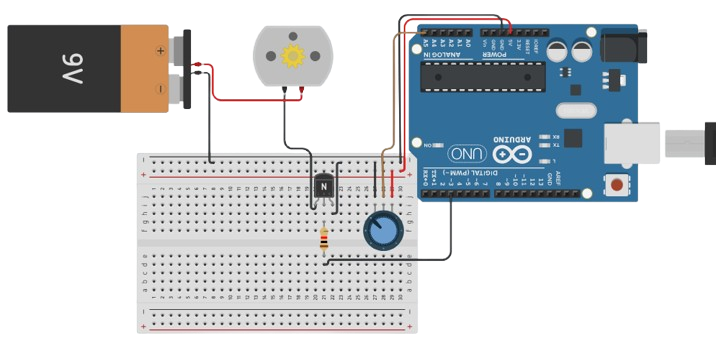
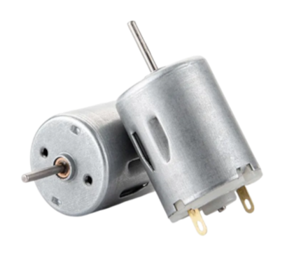
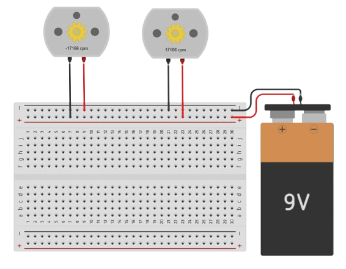
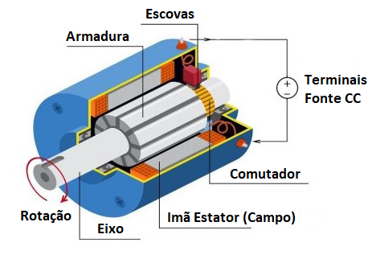
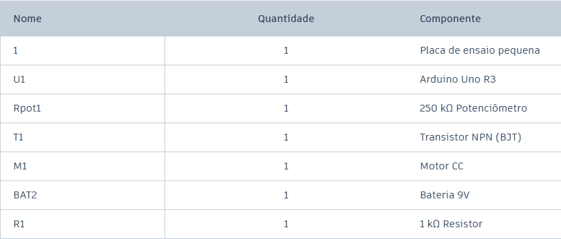
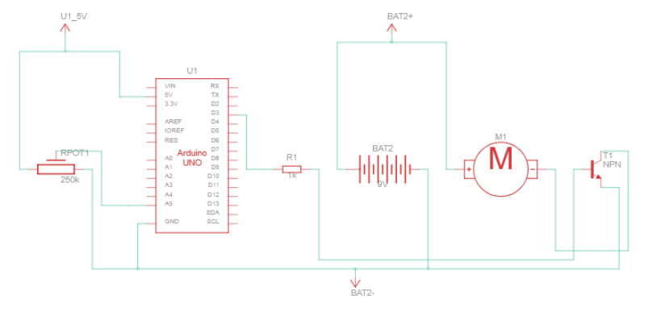
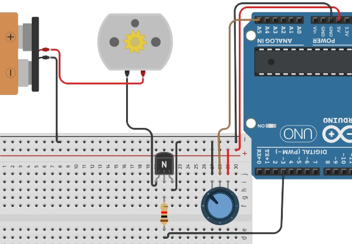

# Controlando velocidade de um motor DC

Neste experimento iremos controloar a velocidade de um motor de corrente contínua utilizando de elementos já estudados anteriormente: leitura da base de um potenciômetro, entrada PWM e transistor NPN regulando a corrente.

<br>
> Imagem do experimento:




## Entendendo os componentes

<br>
### Entendendo o Motor DC

O **motor DC (corrente contínua)** é um dispositivo que transforma energia elétrica em **movimento mecânico**, sendo encontrado em diversos equipamentos do cotidiano, como brinquedos, ventiladores, impressoras e sistemas automotivos. Na **robótica**, ele é fundamental para produzir movimento, permitindo controlar rodas, braços, esteiras e outros mecanismos. Por ser simples de controlar e permitir alterações em sua velocidade e sentido de rotação. 

<br>
> Motores DC mais comuns:



<br>
#### Sentidos de giro

O **sentido de giro de um motor DC** depende da direção da corrente elétrica em seus terminais. Ao **inverter a polaridade** da alimentação, o sentido da corrente também é invertido, fazendo com que o motor passe a girar no **sentido oposto**. Em projetos com Arduino, essa inversão pode ser realizada utilizando uma **ponte H** (recurso que aprenderemos a utilizar em experimentos futuros). Observe a imagem abaixo e repare como o valor das rpm de cada motor estão invertidas:

<br>
> Sentidos de giro motor DC:



<br>
#### Funcionamento interno

Com um tom mais de curiosidade do que de necesidade, vamos entender o funcionamento interno deste componente. O motor DC funciona pela interação entre o campo magnético dos ímãs do estator e a corrente elétrica que passa pela armadura (rotor). As escovas conduzem a corrente até o comutador, que alterna sua direção nas bobinas do rotor, mantendo a força magnética no sentido adequado para produzir a rotação contínua do eixo. Assim, a energia elétrica fornecida pelos terminais é transformada em energia mecânica de movimento.

<br>
> Parte interna do motor: 



<br>
### Entendendo a Bateria 9V

A bateria de 9 V pode ser utilizada em experimentos de robótica como uma fonte de alimentação externa para componentes que exigem mais corrente do que o Arduino consegue fornecer diretamente, como motores e outros atuadores. Dessa forma, o Arduino fica responsável pelo controle dos componentes, enquanto a bateria fornece a energia necessária para seu funcionamento.

<br>
> Bateria 9V


## Entendendo o circuito

<br>
> Relação de componentes:



### Conteúdos anteriores necessários 

Para realizar este experimento, é necessario ter entendido transistores, potenciômetros e utilização de PWM, conteúdos presentes em experimentos do módulo básico, abaixo se encontra um redirecionamento para aqueles que ainda não os realizaram:

- [Aprendendo sobre Transistores](../paginas_arduino/aprend_transis.md)

- [Potenciômetro regulando LEDs](../paginas_arduino/led_potenciometro.md)

<br>
> Circuito esquemátio



Relembrando: iremos ler o sinal do potenciômetro, e com esse valor definiremos a corrente na base de um transistor NPN. A quantidade de corrente na base do transistor é quem vai controlar a corrente que passa do coletor para o emissor e segue para o motor DC, assim, regulando sua velocidade.

Sendo assim, observe no circuito esquemático: o potenciômetro é alimentado unicamente pelo Arduino, e sua base é lida pela entrada A5. O motor DC é alimentado pela bateria 9V, pois a tensão fornecida pelo Arduino é muito baixa para o bom funcionamento dele. E a base do transistor é conectada por um jumper há uma entrada digital com suporte a PWM, para podermos controlar a energia que chega à ela. Observe na imagem com zoom abaixo a implementação do esquema:

<br>
> Zoom ligações do experimento:



<br>
## Entendendo a programação

Não há nada nas linhas de códigos que não tenha sido apresentado nos experimentos básisos. 

Nas declarações, damos nomes para as bases, e definimos variáveis inteiras para armazenar o valor do potenciômetro, e o valor mapeado para 0 a 255 do potenciômetro.

<br>
``` {.cpp linenums="1" title="Declarações"}
#define base_transistor 3
#define base_pot A5 

int valor_fino = 0;
int valor_pot = 0;
```

<br>
No **setup()** inicializamos a comunicação serial e definimos  quem será entrada e quem será saída de dados. Já no loop(), realizamos a leitura do potenciômetro com analogRead() e armazenamos em "valor_pot", após isso, mapeamos o mesmo valor para uma faixa de 0 a 255 e salvamos e armaenamos em "valor-fino", esse último usamos para regular a corrente na base do transistor.

``` {.cpp linenums="6" title="setup() e loop()"}
void setup()
{
  Serial.begin(9600);
  pinMode(base_transistor,OUTPUT);
  pinMode(base_pot, INPUT);
 
}

void loop()
{
  valor_pot = analogRead(base_pot); 
  Serial.println(valor_pot); 
  
  valor_fino = map(valor_pot,0,1023,0,255); 
  analogWrite(base_transistor,valor_fino); 
  delay(100);
}
```